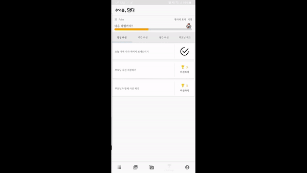
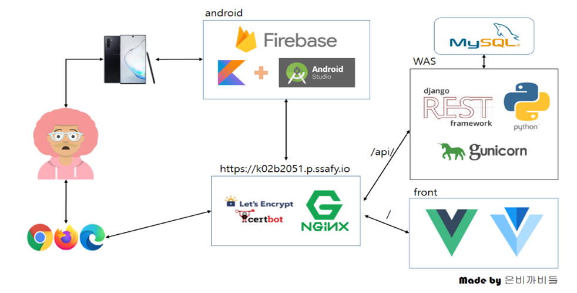

# 1. 팀소개

## 팀명

- 은비까비들 (B205)

## 팀장

- 조선행

## 팀원

- **박태수, 송지영, 장은비, 조규홍**


# 2. 프로젝트 소개

### 주제

- 가족과의 추억을 담는 가족 앨범

### 주요대상

- 부모님과의 추억을 기록하고 싶은 자녀

### 프로젝트 명

- [담다](https://play.google.com/store/apps/details?id=com.ebgbs.damda) 

## 기획 의도:framed_picture:

#### 문제 인식

- 스마트폰 속 갤러리를 살펴보면 친구와 찍은 사진, 반려동물, 음식 사진들은 쉽게 찾을 수 있지만 부모님 사진은 찾기 어려움

#### 만들고자 한 것

- 가족들끼리 조금 더 쉽게 일상을 공유하고, 부모님에 대해 알아갈 수 있도록 하는 앨범
- 미션을 통해서 부모님과의 추억을 만들고 다시 돌아볼 수 있도록 사진으로 저장하는 앨범
- 부모님이 직접 답하신 내용을 이용한 퀴즈를 통해 부모님에 대해 알아갈 수 있도록 하는 앱


# 3. 주요기능

## 1. 앨범

- 인공지능을 활용해 등록된 가족 구성원의 얼굴을 사진에서 인식하여 해당 가족 앨범으로 분류

## 2. 이미지 업로드


- 수동 업로드 
  - 사진 선택을 통해 수동으로 업로드


- 자동 업로드
  - 자동 업로드 설정을 켜놓을 경우, 마지막 자동 업로드 시점으로부터 새로운 사진이 추가될 때마다 자동 업로드를 할 것인지 묻는 창이 나타남
  - 개인적인 사진은 올리고 싶지 않을 경우를 고려하여 본인 사진은 자동 업로드에서 제외됨

## 3. 미션



- 미션
  - 일일, 주간, 월간으로 구분되며 수행할 경우 포인트를 얻음
  - 포인트가 쌓임에 따라 등급이 상승하여 동기 부여를 유도함


- 부모님 퀴즈
  - 부모님 계정으로 접속할 경우 질문에 대한 답을 입력할 수 있는 탭으로 나타남
  - 부모님 계정에서 질문에 답을 입력할 경우 자녀 계정에서는 해당 퀴즈 풀이가 가능함
  - 미션과 마찬가지로 정답을 맞출 경우 포인트가 지급됨

## 4. 푸시 알림

- 최근 업로드된 사진이 없다면 가족과 사진을 찍을 것을 권유하는 알림 전송
- 생일에 본인에게는 축하 메세지를, 가족들에게는 생일임을 알려주는 알림을 전송
- 새로운 사진이 업로드될 경우 알림 전송
- 새로운 부모님 퀴즈가 생성되었을 경우 알림 전송


# 4. 개발 계획

## 주차별 진행 사항

* [1주차](https://lab.ssafy.com/s02-final/s02p31b205/tree/develop/1%EC%A3%BC) : 서비스 기획 자료
* [2주차](https://lab.ssafy.com/s02-final/s02p31b205/tree/develop/2%EC%A3%BC) : 기획 및 코틀린 자료
* 3 ~ 5주차 : 개발 진행
* 6주차 : 스토어 등록, UCC 제작, 버그 수정 및 재배포


## WBS

```mermaid
gantt
    title 담다, Damda
    dateFormat  YYYY-MM-DD #바꾸지 않음 
    section 앨범
   	앨범 목록	:done, 2020-05-08, 7d  #완료되면 done을 기입 
    사진 상세	:done, 2020-05-11, 5d
    앨범 사진 조회	:done, 2020-05-11, 10d
    전체 사진 조회	:done, 2020-05-18, 5d 
    사진 공유	:done, 2020-05-18, 5d 
    앨범 / 사진 내려받기	:done, 2020-05-20, 7d 
    앨범 / 사진 삭제	:done, 2020-05-20, 7d 
    사진 이동	:done, 2020-06-03, 5d 
    
    section 회원관리
    이메일	:done, 2020-05-08, 5d
    카카오	:done, 2020-05-11, 7d
   	가족 만들기	:done, 2020-05-13, 10d
   	가족 구성원 추가	:done, 2020-05-18, 7d
   	요청 수락 / 거절	:done, 2020-05-18, 7d
   	호칭 테이블	:done, 2020-05-29, 7d
   	
    section 업로드
    수동 업로드	:done, 2020-05-11, 10d
    자동 업로드	:done, 2020-05-25, 10d
  
    section 푸시
    푸시 전송	:done, 2020-05-08, 14d
    디바이스 등록	:done, 2020-05-20, 6d
    푸시 자동 전송	:done, 2020-05-27, 5d
    푸시 온오프	:done, 2020-05-30, 7d
    
    section 미션
    메뉴 레이아웃	:done, 2020-05-29, 7d
    등급 구성	:done, 2020-05-29, 4d
    미션 목록 선정	:done, 2020-05-30, 3d
    성공 여부 확인	:done, 2020-06-01, 7d
   	
   	section 웹
   	로그인, 회원가입	:done, 2020-05-30, 7d
   	앨범, 사진 목록 페이지	:done, 2020-05-30, 7d
   	개인 정보 페이지	:done, 2020-05-30, 7d
   
  	section UCC
  	UCC 촬영 / 편집 :done, 2020-06-07, 3d
  	
  	section 배포
  	django 배포 : done, 2020-05-24, 1d
  	vue 배포: done, 2020-05-24, 1d
  	플레이스토어 등록 : done, 2020-06-04, 1d
  	코드 최신화 / 재배포 : done, 2020-06-12, 1d
```


## 시스템 아키텍처




## Android

* [담다](https://lab.ssafy.com/s02-final/s02p31b205/tree/develop/damda) : 안드로이드 프로젝트 ( 주 서비스 )


## Server

* [back](https://lab.ssafy.com/s02-final/s02p31b205/tree/develop/damda-django) : Django REST API


## Web

* [front](https://lab.ssafy.com/s02-final/s02p31b205/tree/develop/damda-vue) : 앱을 잘 이용하지 않는 가족을 위해 사진과 앨범 확인 가능한 웹사이트 구현


# 5. 어려웠던 점

## 1. 프로젝트의 방향성

> 프로젝트 주제를 결정하고 진행이 됐지만 팀원들간의 방향성이 다소 어긋나있었음을 발견
>
> 코드 리뷰 이후 서비스에 대한 방향성을 정확하게 정리 후 진행하기로 결정!

### 본격 효자 만들기 프로젝트!! 

#### 대상

- 주요 대상 : 부모님과의 추억을 기록하고 싶은 자녀
- 가족들도 공유 가능

#### 네비게이션

- 앨범 / 전체 / 업로드 / 미션 / 설정 

#### 알림 

- 생일인 사람 있는 가족 알림 추가 

#### 호칭 테이블

- 로그인된 사용자에 따라 다르게 표기되는 호칭

#### 미션

- 등급 (티어)
- 미션, 포인트 (최대한 사진으로 인식)
- 포즈도 가능하면 추가 계획
- 공유하면 추가 점수
- 기간 챌린지 (20개)
- 미션은 템플릿 정해놓고 그 중에서 랜덤
- 잔디밭 관리처럼 보여주면 괜찮을 듯 

#### 웹

- 사진 보기만 (앨범, 전체)
- 회원가입 x, 로그인 o
- 간단한 개인정보 (이름, 계정)

## 2. 새로운 것에 대한 도전

### 웹 -> 네이티브 앱

- 지금까지의 프로젝트에서 대부분 웹을 기반으로 한 서비스만을 개발하다가 처음으로 네이티브 앱에 도전!
- 팀원 전원이 비전공자로 구성되어 있어서 네이티브 앱에 대한 기본적인 지식이 전무한 상태에서 이러닝과 구글링을 통해 시작함
- 웹으로 구현했다면 더 빨리 끝났을 기능도 네이티브 앱에서 구현하기 위해 더 많은 시간을 투자해야만 했음

### 안드로이드 버전에 따라 달라지는 코드

- 설령 기능을 구현했다고 하더라도 지원하는 안드로이드 버전의 범위에 따라 같은 코드를 다르게 작성해야만 하는 문제가 있었음
- 팀원 대부분이 정상적으로 작동한다고 생각했던 기능도 일부 버전에서는 전혀 다르게 작동했기 때문에 뒤늦게 발견하고 수정한 부분도 다수!


# 6. 발표자료

[발표자료 PPT](./발표자료/최종발표_제출용.pptx)